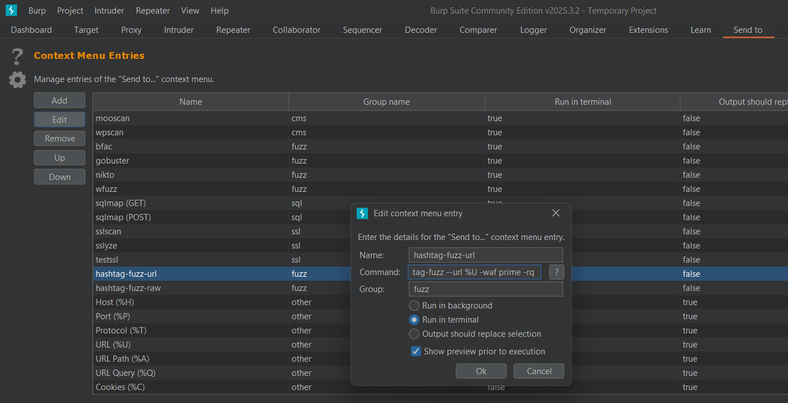

# Hashtag-Fuzz

<div align="center">

**The nightmare of WAFs & CDNs**

[]()
&nbsp;[]()&nbsp;[](LICENSE)


**This tool uses multiple tricks for bypass rate limit of WAFs & CDNs & Webservers and application layer protections.**

[Installation](https://github.com/Hashtag-AMIN/hashtag-fuzz#Installation) &nbsp; [Features](https://github.com/Hashtag-AMIN/hashtag-fuzz#Features) &nbsp; [Usage](https://github.com/Hashtag-AMIN/hashtag-fuzz#Usage) &nbsp; [Documentation](https://github.com/Hashtag-AMIN/hashtag-fuzz/wiki)

</div>

<hr>


**hashtag-fuzz** is a fuzzing tool designed to test and bypass WAFs and CDNs ratelimit. By leveraging features such as random User-Agent and header values, random delays, and multi-threading handling, selective chunking of wordlists and Round Robin proxy rotation for each chunked, It offers a robust solution for security professionals aiming to identify vulnerabilities in web applications. This tool stands out as the almost first in its class for test ratelimit in WAFs, CDNs, Webservers and application layer protection.

## Installation:

First, install the amazing fuzzing tool: [ffuf](https://github.com/ffuf/ffuf#installation), <br>
Allow ffuf global access in the OS, If not, place it in the same folder as this script, then:

```bash
git clone https://github.com/Hashtag-AMIN/hashtag-fuzz.git
cd ./hashtag-fuzz
chmod +x ./hashtag-fuzz
./hashtag-fuzz
```
All library used is built-in python library, No need pip ;)

#### Global access:

```bash
cp /root/go/bin/ffuf /usr/local/sbin/ || cp /home/${USER}/go/bin/ffuf /usr/local/sbin/
cp ./hashtag-fuzz /usr/local/sbin/
```

# Features:

- ***Control Threads for Fuzzing:*** The tool allows users to control the number of threads for fuzzing. By adjusting the thread count, you can manage the tool's performance and ensure that your fuzzing activities do not overwhelm the target server, By default, ffuf uses 40 threads!
- ***Random Delay Control:*** Delay is useful, but random delay is magic, Implementing random delays between requests is crucial for bypassing WAFs and mimicking human behavior to avoid detection.. The tool reads and applies random delays from the configuration, adding an extra layer of sophistication to your fuzzing activities.
- ***Random User-Agent and Proxy Headers:*** The tool supports randomizing User-Agent and Proxy headers with internal IP address, which is essential for evading WAF detection. By sending requests with varying headers, the tool helps you bypass WAFs more effectively.
- ***Tamper Proxy Headers*** Add one of the top proxy headers and set value onetime with internal IP, one time with NULL value
- ***Append random query with or without whitespace characters to the URL:*** Append random query with or without withspace character to url
- ***Change Case of URL Words:*** make uppercase one of the word of url
- ***Add Browser Headers*** Add headers which append by browser for simulate request from browser 
- ***Proxy and TOR Support:*** To further enhance the tool's stealth capabilities, you can route requests through proxies or Tor. This feature ensure that your requests appear as though they are coming from different IP addresses, making it harder for WAFs to detect and block your fuzzing activities.
- ***Selective Chunking of Wordlists:*** The tool allows you to split your wordlist into chunks, sending each chunk with random headers, User-Agent, and IPs. This feature is especially useful when dealing with large wordlists, as it optimizes the fuzzing process.
  - ***Round Robin Proxy Usage:*** Rotate proxies in a round-robin manner for each chunk.
  - ***TOR IP Cycling:*** Each chunk sent through TOR will use a different source IP, improving chances of bypassing WAF/CDN filters.
  - ***Set User-Agent and Headers value:*** set new User-Agent and New internal IP address for each chunk.
  - ***Sleep beetween each chunk:*** Able select you chunk and sync with sleep time and random delay in high restrictions

Checkout more details in [wiki/home](https://github.com/Hashtag-AMIN/hashtag-fuzz/wiki)

## WAF Modes:

The tool supports four WAF Modes, each with specific configurations:

| WAF Modes   | Description |
|-------------|-------------|
| ***entry***   | Basic WAF with minimal protection. Suitable for initial testing. |
| ***common***  | Standard WAF with common protection. Suitable for general-purpose testing. |
| ***pro***     | Advanced WAF with more sophisticated protection. Suitable for testing against professional-grade WAFs. |
| ***prime***   | Premium WAF with the highest level of protection. Suitable for testing against enterprise-grade WAFs. |

<hr>

## Now let see more details: 

Hashtag-Fuzz supports four WAF modes, each offering unique features and configurations:

| Mode   | Control Threads for Fuzzing | Control Random Delay | Random User-Agent & Headers | Chunk size of split wordlist|
|--------|-----------------------------|----------------------|-----------------------------|-----------------------------|
| ***entry*** | Basic thread control, limited 20 Threads | Minimal delay, random delays between 0.1-0.3s | Random User-Agent and Randomization 6 top headers for simulate internal network | split wordlist to 250 chunks |
| ***common*** | Improved thread management, limited 10 Threads | Introduces random delays between 0.2-0.5s | Random User-Agent,  Randomization 10 top headers with random local/Private IP | split wordlist to 200 chunks |
| ***pro*** | Advanced thread control, limited 5 Threads | random delays between requests 0.5-1s | Random User-Agent and Randomization efficient headers with local/Private range | split wordlist to 100 chunks |
| ***prime*** | Maximum thread control, limited 1 Threads | Max delay, random delays between 1-2s | Most useful headers randomization and Random User-Agent | split wordlist to 50 chunks |

Checkout more details in [wiki/waf-mode](https://github.com/Hashtag-AMIN/hashtag-fuzz/wiki)

**Remember, All this value is selective with argument and you can add custom value ;)**

## Usage:

```
└─# ./hashtag-fuzz -h
 __                       __      __                             ___
/\ \                     /\ \    /\ \__                        /'___\
\ \ \___      __      ___\ \ \___\ \ ,_\    __       __       /\ \__/ __  __  ____   ____
 \ \  _ `\  /'__`\   /',__\ \  _ `\ \ \/  /'__`\   /'_ `\_____\ \ ,__/\ \/\ \/\_ ,`\/\_ ,`\
  \ \ \ \ \/\ \L\.\_/\__,/`\ \ \ \ \ \ \_/\ \L\.\_/\ \L\ \_____\ \ \_\ \ \_\ \/_/  /\/_/  /_
   \ \_\ \_\ \__/.\_\/\____/\ \_\ \_\ \__\ \__/.\_\ \____ \____/\ \_\ \ \____/ /\_/__\/_/___\
    \/_/\/_/\/__/\/_/\/___/  \/_/\/_/\/__/\/__/\/_/\/___L\ \     \/_/  \/___/  \/____/\/____/
                                                     /\____/
                                                     \_/__/
                                                            The nightmare of WAFs & CDNs
                                                    https://github.com/Hashtag-AMIN/hashtag-fuzz

usage: hashtag-fuzz [-h] [-u URL] [-U URLS] [-request REQ_RAW] [-H HEADER] [-b COOKIE]
                    [-d DATA] [-X METHOD] [-r] -w WORDLIST [-t THREAD] [-p DELAY]
                    [-waf {entry,common,pro,prime}] [-cs CHUNK_SIZE] [-rq] [-rs] [-ct]
                    [-ht] [-sl SLEEP] [-x [PROXY]] [-xf PROXY_FILE] [-tor [TOR]] [-o OUTPUT] 
                    [-of {txt,csv,json}] [-a ADDITIONAL_CMD] [-v]

options:
  -h --help            show this help message and exit
  -u --url             Target URL
  -U --urls            File include List of Target URLs
  -request --req-raw   File containing the raw http request [-request-proto default: https, change
                       with -a flag: -a="-request-proto http"]
  -H --header          Custom headers to add to requests, Multiple -H flags are accepted.
  -b --cookie          Cookie data `"NAME1=VALUE1; NAME2=VALUE2"` for copy as curl[ffuf] functionality.
  -d --data            Body to send with the request
  -X --method          HTTP method to use (e.g.,GET,POST,PUT)
  -r --redirect        Follow redirects (default: false)
  -w --wordlist        Path to wordlist, Multiple -w/--wordlist flags are accepted and fuzz with all wordlist.
  -t --thread          Threads use in ffuf (default: [select with waf mode])
  -p --delay           Random delay range use in ffuf (default: [select with waf mode]) For example "0.5-2.0" or "0.3"
  -waf --waf-mode      WAF behavior mode: entry, common, pro, prime
  -cs --chunk-size     Split each wordlist with Chunk size, (default: 300)
  -rq --random-qurey   Append a random query string to url
  -rs --random-space   Append a random query with whitespace characters end of url
  -ct --case-tamper    Uppercase random word of host in each junk
  -ht --header-tamper  Add & repeat proxy/CDN headers with Null value
  -sl --sleep          Sleep beetween fuzzing each junk of wordlist
  -x --proxy           Proxy server(s) to use (default: http://127.0.0.1:8080 for Burp) Multiple -x/--proxy flags are accepted
  -xf --proxy-file     Proxy servers file to use
  -tor --tor           Use Tor with unique(dynamic) IP for each chunk of wordlist (default: socks5://127.0.0.1:9050)
  -o --output          Output file name of FFUF result
  -of --output-format  Output of FFUF brief and useful mode: txt, csv, json (default: txt)
  -a --additional-cmd  Additional commands for FFUF
  -v --verbose         verbose mode (default: false)

```
Checkout more details in [wiki/Basic-fuzz](https://github.com/Hashtag-AMIN/hashtag-fuzz/wiki)

### Simple usage for Fuzzing URL/URLs/Raw-request/Pipe

```bash
./hashtag-fuzz -u http://site.tld/FUZZ -w ./wordlist.txt -waf pro --case-tamper -b "Cookie: key=value;"
```
```bash
./hashtag-fuzz -U ./urls.txt -w ./wordlist.txt -H "X-header: header-value" --header-tamper -cs 10
```
```bash
./hashtag-fuzz -request ./req-raw.txt -w ./wordlist.txt -waf common -xf ./proxy.txt --random-qurey -r
```
```bash
echo 'http://site.tld' | ./hashtag-fuzz -w ./wordlist.txt -d "var1=FUZZ&var2=val2" -X "PUT" -tor
```
- #### Don't forget URLs include the FUZZ keyword when using --urls or urls come from stdin

Checkout more details in [wiki/ratelimit-tricks](https://github.com/Hashtag-AMIN/hashtag-fuzz/wiki)

### additional commad, Match and Filter

If you need add some command in ffuf, you can write it as string in -a/--additional-cmd argument

```bash
cat ./urls.txt | ./hashtag-fuzz -w ./wordlist.txt -waf common -d "data-var=FUZZ" -X "PUT" -a="-mr '.*Keyword$'"
```
```bash
./hashtag-fuzz -U ./urls.txt -w ./wordlist.txt -waf prime -cs 15 -tor --sleep 5 -a='-fc 401,403'
```
#### Point: Use '=' (equal sign) instead of a space for avoid error in argparser library just for -a/--additional-cmd flag, because the value may include special characters.

## Best usage

If you want fuzz but waf or cdn block in high rate in request, use these techniques together

```bash
./hashtag-fuzz -u "http://site.tld/FUZZ" -w ./wordlist.txt -waf prime -cs 20 -tor -rq -ht -ct -sl 3
```
```bash
cat ./urls.txt | ./hashtag-fuzz -w ./wordlist.txt -waf prime -cs 30 -xf ./proxy.txt -rq -ht -ct -sl 5
```

## What about Burp and Custom-Send-To:



Set these command in custom-send-to extention for use in Burp:
```bash
hashtag-fuzz --url %U -b %C -X %M -waf prime -rq -ht -ct -w /path/of/wordlist
```
Better use raw request:
```bash
hashtag-fuzz -request %R -waf prime -rs -ht -ct -w /path/of/wordlist
```

## In useful flow

- Use [paramspider](https://github.com/devanshbatham/ParamSpider), [httpx](https://github.com/projectdiscovery/httpx) and [qsreplace](https://github.com/tomnomnom/qsreplace) for flow in fuzzing

```bash
paramspider -d site.tld -s | httpx -silent | hashtag-fuzz -waf prime -rs -ht -ct -w ./payload.txt -a='-ac'
```

```bash
grep \? urls.txt | qsreplace FUZZ | httpx -silent | hashtag-fuzz -waf pro -ct -w ./payload.txt -a='-ac'
```

For more details and documentation checkout [**wiki/Best-usage**](https://github.com/Hashtag-AMIN/hashtag-fuzz/wiki)

### Happy Hunting, Happy learning ;)
